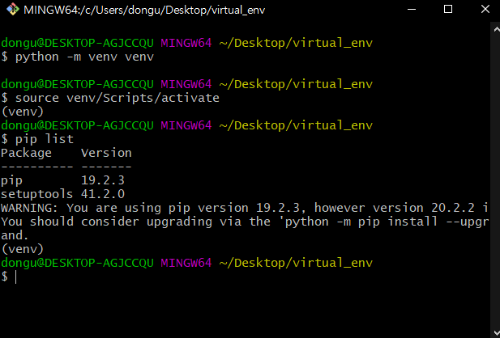
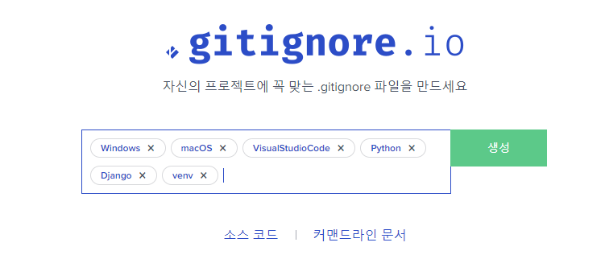

# Django 학습내용

> Admin, VENV, GIT Ignore, Fixture, Freeze 등


## 1. Admin

- 어렵다.. Toy PJT 등 개인적으로 여러번 해보면서 숙달하는 수 밖에..!

```python
from django.contrib import admin
from .models import Review

# Register your models here.
class ReviewAdmin(admin.ModelAdmin):
    list_display = (
        'title', 'content', 'rank', 
        'created_at', 'updated_at'
    )


admin.site.register(Review, ReviewAdmin)
```

```bash
$ python manage.py createsuperuser
Username: admin
Email address: admin@admin.com
Password: admin
Password (again): admin
```


## 2. 가상환경(Virtual Environment)

> 파이썬 인터프리터, 라이브러리 및 스크립트가 "시스템 파이썬"(글로벌 환경)에 설치된 모든 라이브러리와 격리 되어있는 파이썬 환경





### 2.1 왜 사용하는지????

1. 여러 pjt 진행하다보면 다른 버전의 라이브러리가 필요할 수 있는데, 하나의 파이썬에는 하나의 버전만 설치 가능

2. 라이브러리나 모듈은 서로에 대한 의존성(dependency)이 다르기 때문에 알 수 없는 충돌이 발생하거나 다른 여러 문제를 일으킬 수 있게 된다.

### 2.2 가상환경 만들기

- 만들기

  ```bash
  $ python -m venv {가상환경이름}
  ```

- 활성화

  - Windows(git bash)

  ```bash
  $ source {가상환경이름}\Scripts\activate
  ```

- 비활성화

  ```bash
  $ deactivate
  ```

  

## 3. GIT Ignore

1) 파일 backup 정보, build 정보, DB 등이 Repository에 올라가는 것을 막기 위해.

2) 각종 충돌, Noise 방지




## 4. Fixture 사용하기

- dumpdata

  ```bash
  $ python manage.py dumpdata community.Review --indent 4 > reviews.json
  ```

  


## 5. Freeze 사용하기

> 협업/배포 과정에서 가상환경 정보? 개발환경?까지 전달해주기 위해서..?!

- freeze

  ```bash
  $ pip freeze > requirements.txt
  (venv)
  ```

  